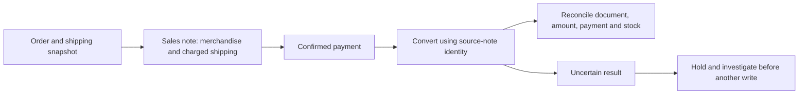

# Beyond the happy path: validating an inventory-to-invoice integration

[中文](relbase-integration.zh-CN.md) · [Project overview](../README.md)

**Plexoria engineering case study · Status reviewed 10 September 2026**

Connecting a storefront to an ERP is more than sending a valid request. One purchase must remain consistent across stock, payment, shipping charges and the tax document—even when a response is missing or a documented conversion behaves differently in a particular workflow.

This case describes work on Plexoria's private Pro integration with RelBase. The public contribution is the investigation method, the design decisions and their limits. The production adapter and operational records are not included in Community.

## The business invariant

A sales note commits merchandise inventory before payment. After payment, the resulting Boleta or Factura must refer to that note, preserve the complete payable amount and avoid a second stock deduction.

A successful HTTP response alone does not prove those conditions. Conversely, a rejected API request is not evidence that the tax authority rejected a document.

## What the investigation established

| Observation | Engineering response |
| --- | --- |
| The conversion path required source-note identity, yet controlled requests encountered incompatible detail validations. | Reduced the case to paired requests with and without explicit lines, captured correlation identifiers and the source-note state, and asked support to inspect the executed validation path. |
| Shipping appeared in the order but could be absent from an earlier source note. | Treated this as a separate local completeness issue. Included charged shipping in the source document through a non-stock service mapping; free shipping adds no line. Did not claim this explained the conversion response. |
| A generally advertised idempotency header was not sufficient evidence of replay protection for the document resource. | Verified the guarantee with the provider and designed durable application-side dispatch protection. A timeout or empty lookup does not authorize another document creation. |
| Source and destination documents can interpret amounts differently. | Kept new source notes in gross, IVA-inclusive CLP values and let conversion inherit their amount mode. Preserved local line/total checks rather than relying on the payment amount to repair an incomplete source note. |

The provider's technical review clarified the conversion behavior and the required source amount mode. A provider-side update was scheduled. This was a collaborative contract-validation process: the useful outcome is a more precise integration boundary and a testable acceptance plan.

## Design decisions that followed

**Protect the write before sending it.** A durable claim, keyed by provider connection and stable business command, is recorded before an external creation request. A second worker or a restarted process cannot silently dispatch the same command again. Document writes do not inherit generic automatic replay on authentication failure or redirects.

This is application-side duplicate-dispatch protection, not an end-to-end “exactly once” guarantee. If the process stops after the claim but before the request, reconciliation or an explicit recovery decision is necessary. That availability tradeoff is preferable to blindly duplicating a stock or fiscal operation.

**Keep amount and inventory scopes distinct.** Charged shipping belongs in the monetary document but not in merchandise inventory checks or deductions. The fiscal command must match the source note's product identities, quantities, prices, fees and total. Historical notes are checked individually; changing today's payload does not repair yesterday's document.

**Reconcile the business result.** Acceptance requires the emitted document identity and status, source linkage, payable total, payment handling and inventory quantity. A zero-quantity stock-history entry can be consistent with traceability; counting stock-history rows is not a reliable test for a second deduction.

**Keep provider specifics at the adapter boundary.** The application retains generic shipping charges and business commands. Provider service identifiers, wire fields and conversion semantics belong in the connector. This limits the effect of a provider contract change on checkout and order logic.

## Evidence and current limits

As of 10 September 2026:

- The local shipping-completeness change, dispatch protection and amount-mode preparation have been implemented and deployed in Pro.
- The conversion simulation covers 12 combinations: Boleta/Factura, free/two charged-shipping amounts, and one/three merchandise units. It inherits the lines actually received when creating the simulated source note, rather than fabricating an invoice total from the expected answer.
- Backend race checks against PostgreSQL 14 and Redis 7, and the release regression suite, passed. These are reported results from the private implementation, not tests a Community checkout can reproduce.
- The updated provider conversion has **not yet been accepted in a live end-to-end test**. Controlled conversion retries remain on hold pending release confirmation and reconciliation of the selected source note.

This case does not claim that Plexoria was the first or only integrator to encounter the issue. It demonstrates finding and resolving assumptions that ordinary successful-request testing would miss. Future live results should be recorded as a dated update, not retroactively presented as already verified.

## What this demonstrates in an engineering portfolio

- Reproduction and fault isolation across application, provider and fiscal-status boundaries.
- State-machine reasoning when local persistence and external side effects are not atomic.
- Monetary and inventory invariants, including shipping and gross/net amount semantics.
- Evidence-driven collaboration with an external technical team.
- A release process that separates deployed safeguards from unverified external capability.

A concise portfolio description:

> Developed a Chilean commerce integration around stock, payments and tax documents; reproduced conversion edge cases, coordinated provider contract clarification, and implemented durable dispatch protection and source-document amount validation. Deployed the safeguards while keeping external conversion acceptance explicitly gated.

No customer records, production identifiers, private support correspondence or backend source code are published in this case study.
