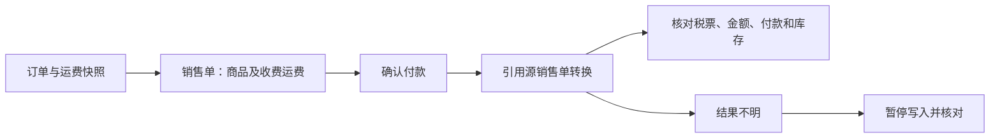

# 不止于接口调通：验证库存到税票的交易一致性

[English](relbase-integration.md) · [项目介绍](../README_zh.md)

**Plexoria 工程案例 · 状态核对日期：2026 年 9 月 10 日**

电商接入 ERP，难点不止是构造一个合法请求。一笔交易经过库存、付款、运费和税务单据后，业务结果仍需一致；网络断线、进程重启或某条转换路径与预期不同，都不能让同一订单再次扣库存或重复开票。

本案例来自 Plexoria 私有 Pro 版的 RelBase 集成。社区版公开调查方法、设计取舍和验证边界；生产适配器与运营记录仍保留在私有实现中。

## 先定义什么才算成功

下单时由销售单承诺商品库存；付款后，由该销售单转换为 Boleta 或 Factura。转换必须保留源单关联、完整应付金额，并且不能再次减少商品库存。

接口返回成功，不等于这些条件已经满足；接口校验拒绝，也不应直接显示成税务机关拒票。

## 如何把模糊问题拆开

| 观察 | 采取的工程行动 |
| --- | --- |
| 转换要求引用源销售单，但受控请求遇到互不相容的明细校验。 | 对比附带与不附带明细的请求，保留关联标识和源单状态，将问题收敛到可供技术团队定位的执行路径。 |
| 订单中包含运费，早期源销售单可能没有。 | 承认并单独修复本地金额完整性问题。收费运费通过非库存服务映射进入源单，免运费不加行；不把这一发现直接当成转换报错的原因。 |
| API 通用层列出的幂等请求头，不能自动证明单据资源具备重放保护。 | 向供应商核实实际保证，并实现本地持久化发送保护；不能因为超时或一次查询未找到，就认定可以再次开单。 |
| 源单与税票可能采用不同的金额解释方式。 | 新销售单统一使用含 IVA 的整数 CLP 金额，转换沿用源单模式；同时保留明细与总额校验，不能靠付款金额补救缺项源单。 |

供应商技术审查随后澄清了转换行为与源单金额要求，并安排了接口更新。这段经历的价值在于把隐含假设变成明确契约和可验证条件，而不是给合作方贴标签。

## 设计中真正需要取舍的地方

**先记下发送资格，再请求外部系统。** 按提供方连接和稳定业务命令建立持久化认领，避免并发工作进程、重启或重复操作再次发送同一开单命令。单据写入也不能直接套用通用客户端在认证失败、重定向时的自动重发策略。

这保护的是本地重复发送，并不承诺跨系统“恰好一次”。如果进程在认领后、请求发出前停止，可能需要人工核对或明确恢复。这里接受可用性上的取舍，避免不确定结果引发第二次库存或开票操作。

**金额范围与库存范围分开。** 收费运费是单据金额的一部分，但不是商品库存的一部分。出站前核对源单商品标识、数量、价格、费用和总额；旧单逐笔核实，不能用新代码推断旧单已经完整。

**验证业务结果，而非表面现象。** 联调需要核对税票身份与状态、源子单据关联、应付金额、付款处理和库存数量。数量为 0 的库存追踪记录可能是合理留痕，不能用“库存流水增加了一行”判定重复扣库。

**把供应商差异留在适配器里。** 应用保存通用运费和业务命令，提供方服务项目标识、接口字段及转换规则由连接器处理，减少契约变化对结算和订单逻辑的影响。

## 已完成什么，尚未证明什么

截至 2026 年 9 月 10 日：

- 源单运费完整性、防重复发送和金额模式适配已在 Pro 实现并部署。
- 转换模拟覆盖 12 种组合：Boleta/Factura、免运费/两档收费运费、单件/三件商品。模拟服务继承创建源单时实际收到的行，不直接把本地期望总额当作成功响应。
- 私有实现通过 PostgreSQL 14、Redis 7 环境的后端竞态检查和发布回归。这里记录的是私有实现的测试结果，不代表读者能在社区仓库复跑这些后端测试。
- **新版外部转换尚未完成真实端到端验收。** 受控转换重试仍等待实际发布确认和待测源单核对。

本案例不声称“业内首个”或“别人都没发现”。它展示的是：通过真实交易约束，识别普通成功请求测试覆盖不到的接入边界。后续联调结果应按日期补充，不提前写成已验证能力。

## 可以用于求职展示的能力

- 跨本地系统、外部接口和税票状态的复现与故障隔离。
- 本地事务与外部副作用无法原子提交时的状态机设计。
- 运费、含税/未税语义、金额与库存不变量校验。
- 基于最小复现和证据推动外部技术协作。
- 区分“保护措施已上线”与“外部能力已验收”的发布判断。

可用于作品集的简述：

> 围绕智利电商库存、付款与税务单据构建集成流程，通过受控复现识别转换边界并推动供应商契约澄清；实现持久化防重复发送、源单金额完整性校验和回归验证，在保护措施上线的同时保留外部转换验收门禁。

本文不公开客户记录、生产标识、私人往来邮件或后端源代码。
